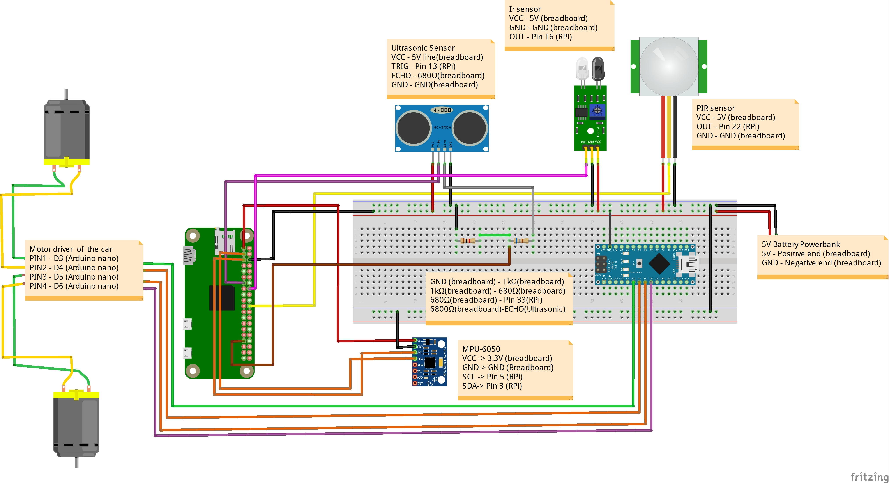
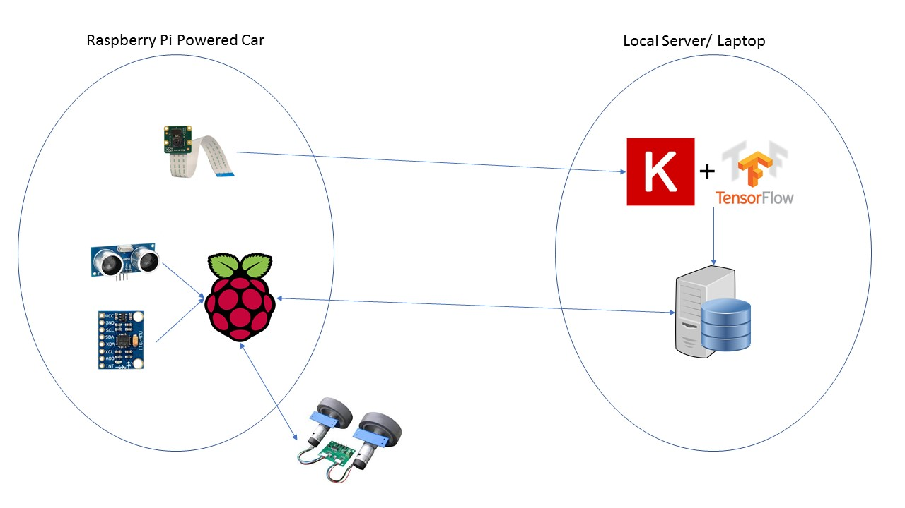

This repository walks you through building a driverless car. It is composed of two components:

* A raspberry PI powered car
* A laptop for the ML training

## Requirements 

Set up Python 2 environment on the Raspberry PI. To run the data collection script, you will need to set up Python 2.7 on Anaconda; whereas, to run the script that will do the model training, you will need to use Python 3.6 on Anaconda (Follow the instructions below to set up the environment, bearing in mind the version of Python to be used).

Make sure to assemble the car beforehand as per the instructions below (this diagram was created by TheAssembly and can also be found on [TheAssembly/IBM_selfdriving](https://github.com/The-Assembly/IBM_selfdriving) repository.



## Setting up the environment

**1.Install Anaconda**

You can either install Anaconda from [here](https://docs.anaconda.com/anaconda/install/), or get [miniconda](http://conda.pydata.org/miniconda.html), which is a lighter version of Anaconda, on your machine. Detailed instructions for miniconda can be found [here](http://conda.pydata.org/docs/install/quick.html#linux-miniconda-install)
  

**2.Setup the environments**

Create an environment, for our purposes we will name it `sdc`, or you can name as you wish.
  
  ```
  conda create -n sdc python=3.6
  ```
  
Running this command will create a new `conda` environment that is provisioned with all libraries you need to run the codes in this repo successfully. Note that you will need to create another environment using a different name(`sdc27` for instance) that uses Python 2.7 to run the data collection script (or you can modify the script such that you can run it on Python 3.6)

#### Uninstalling an enironment

To uninstall the environment:

  ```sh
  conda env remove -n sdc
  ```

**3. Activate the `sdc` environment:**

  ```sh
  $ source activate sdc
  ```
On Windows, just run:

  ```sh
  $ activate sdc
  ```

Activate `sdc27` in the same manner to run the data collection script.

**4. Install Tensorflow**
  ```
  conda install -c conda-forge tensorflow
  ```

**5. Install Keras**
  ```
  conda install -c conda-forge keras
  ```

**6. Install OpenCV**
  ```
  conda install -c conda-forge opencv 
  ```

**7. Install Numpy**
  ```
  conda install -c conda-forge numpy 
  ```


Note that you need to install Tensorflow and Keras only on the environment that uses Python 3.6.


## Architecture



As seen in the architecture image, the car collects sensor data and images, then they are all sent to a local server for processing. For training, the images are sent to train a model built with Keras, however when deployed, the images are passed on to this model which returns an instruction. The instruction is then passed back to the raspberry pi which in turn sends commands to the motors.

## Car

In the [Raspberry Pi Folder]('RaspberrPI/'), there are 2 files: 

* `control_rc.py`: receives commands from the computer to control the car.
* `send_data_inti.py`: sends data from the car back to the computer for processing.

In the [Arduino Folder]('Arduino/'), there is 1 file: 
* `rc_control_arduino.ino`: sends commands from the raspberry pi to the arduino to instruct the motor to rotate.

## Computer

In the [Computer Folder]('Computer/'), there are 4 files, two scripts and two model files:

* `collect_training_data.py`: Receives the data sent from the car and saves it on the computer.
* `model.py`: used to train the models based on the data collected from the car. The model is built from the image data collected. 
* `move_model.h5` and `steer_model.h5`: pretrained models to control the car based based on lane tracking.

## The Model


The trained Machine Learning model is built with Keras on top of Tensorflow. It was developed by [Nvidia](https://devblogs.nvidia.com/deep-learning-self-driving-cars/) for their self driving cars, and was adapted for the purpose of this workshop. 


In principle, the model takes in the images from the camera and then produces a command dependant on the position of the lanes in the camera frame. 

## Procedure

- Place `control_rc.py` and `send_data_inti.py` on the RaspberryPI and make sure to replace the IP address to that of your machine.
- Compile `rc_control_arduino.ino` on the arduino.
- Place `collect_training_data.py` on your machine.
- Run `control_rc.py` and `send_data_inti.py` on the RaspberryPI and `collect_training_data.py` on your machine using the conda environment that uses Python 2.7 (remember to change the IP address in `collect_training_data.py` to that of your machine). Notice that in `collect_training_data.py`, msvcrt used to get the record key stroked (use a different library on on other Operating Systems)
- Take the car for a drive around the track, allowing the collection of the data to be used to tarin your model.
- Run `model.py` making sure you place the data to be consumed by the script in the appropriate location. The result of running the script should be `move_model.h5` and `steer_model.h5`
- Create the testing script, which is similar to the `collect_training_data.py`, and add it to your machine. The modification to the script will include reading the model:
  ```python
  steer_model = load_model('steer_model.h5')
  move_model = load_model('move_model.h5')
  ```

and adding the snippet that will make the prediction, based on which commands will be sent to the Raspberry PI, which in turn relays them to the Arduino.
 
  ```python
  # Start predictions from the model
  steer_predictions = steer_model.predict(temp_arr, batch_size=1)
  print(steer_predictions)
  
  move_predictions = move_model.predict([self.ultrasonic, self.ir, self.pir], batch_size=1)
  print(move_predictions)
  # if msvcrt.kbhit():
  #     key = msvcrt.getch()
  #print(key)
  if move_predictions > 1.2 and move_predictions <= 2.2:
      self.conn.sendall('ff')
  elif  move_predictions > 0.5 and move_predictions <= 1:
      self.conn.sendall('ss')
  elif move_predictions <= -0.5 and move_predictions <= -1:
      self.conn.sendall('bb') 
  elif move_predictions >= -0.5 and move_predictions <= 0.5:
      self.conn.sendall('no')           
  if steer_predictions <= -0.5 and steer_predictions <= -1:
      self.conn.sendall('ll')
  elif steer_predictions > 0.5 and steer_predictions <= 1.1:
      self.conn.sendall('rr')
  elif steer_predictions >= -0.5 and steer_predictions <= 0.5:
      self.conn.sendall('no')
  ```  
  
